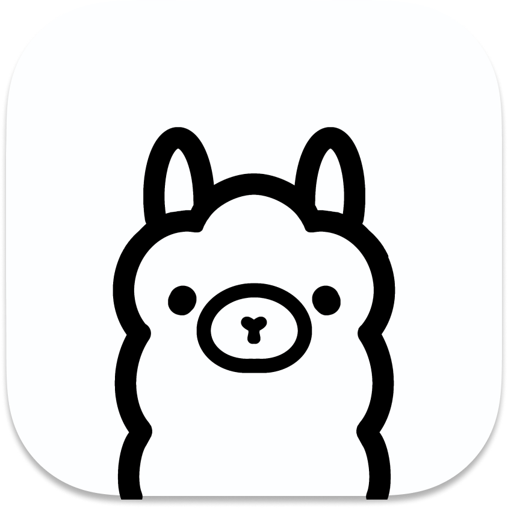

<div align="center">
  <h1> Ollama Native</h1>
</div>
<div align="center">
  <a href="https://ollama.com">
    
  </a>
</div>
<div align="center">
  <strong>A modern TypeScript client library for Ollama API</strong>
</div>
<div align="center">
  <p>
    <strong>Alternative to:</strong> 
    <a href="https://github.com/ollama/ollama-js">Official Ollama JavaScript Library</a>
  </p>
</div>
<div align="center">
  <a href="https://www.npmjs.com/package/@neabyte/ollama-native">
    
  </a>
  <a href="https://github.com/neabyte/ollama-native/blob/main/LICENSE">
    
  </a>
  <a href="https://www.typescriptlang.org/">
    
  </a>
</div>

## ✨ Features

- 🎯 **TypeScript Support** - Built with TypeScript for type safety
- 🔄 **Retry Mechanism** - Automatic retry with exponential backoff
- ⏱️ **Request Timeouts** - Configurable timeout handling
- 🛡️ **Error Management** - Structured error handling with context
- 🚀 **No Dependencies** - Zero external dependencies
- 🔧 **Configuration Options** - Customizable headers, timeouts, and retries

---

## 🚀 Quick Start

### Installation

```bash
npm install @neabyte/ollama-native
```

### Basic Usage

```typescript
import { 
  ChatMessage,
  ModelCopyRequest,
  ModelData,
  ModelDeleteRequest,
  ModelProgress,
  ModelPullRequest,
  ModelPushRequest,
  ModelShowRequest,
  ModelShowResponse,
  ModelStatusResponse,
  OllamaConfig,
  OllamaService,
  RequestChat,
  RequestGenerate,
  ResponseChat,
  ResponseGenerate,
  ToolCall
} from '@neabyte/ollama-native'

// Basic configuration
const basicConfig: OllamaConfig = {
  host: 'http://localhost:11434'
}

// Advanced configuration with all options
const advancedConfig: OllamaConfig = {
  host: 'http://localhost:11434',
  timeout: 30000,     // Request timeout in milliseconds
  retries: 3,         // Number of retry attempts
  headers: {          // Custom HTTP headers
    'Authorization': 'Bearer your-token',
    'X-Custom-Header': 'value'
  }
}

// Create service instance
const ollama = new OllamaService(advancedConfig)

// List available models
try {
  const models = await ollama.list()
  console.log('Available models:', models)
} catch (error) {
  console.error('Failed to fetch models:', error.message)
}
```

---

## 📖 API Reference

### abort

```typescript
ollama.abort()
```

- Returns: `boolean`
- Description: Aborts the current request if one is active. Returns true if request was aborted, false if no request was active.

### chat

```typescript
ollama.chat(request)
```

- `request` `<RequestChat>`: The request object containing chat parameters.

  - `model` `<string>`: The name of the model to use for the chat.
  - `messages` `<ChatMessage[]>`: Array of message objects representing the chat history.
    - `role` `<string>`: The role of the message sender ('user', 'system', 'assistant', or 'tool').
    - `content` `<string>`: The content of the message.
    - `images` `<Uint8Array[] | string[]>`: (Optional) Images to be included in the message, either as Uint8Array or base64 encoded strings.
    - `tool_call_id` `<string>`: (Optional) Tool call ID for tool responses.
    - `tool_calls` `<ToolCall[]>`: (Optional) Tool calls made by the assistant.
    - `tool_name` `<string>`: (Optional) Add the name of the tool that was executed to inform the model of the result.
  - `format` `<string | object>`: (Optional) Set the expected format of the response (`json`).
  - `stream` `<boolean>`: (Optional) When true an `AsyncGenerator` is returned.
  - `think` `<boolean | "high" | "medium" | "low">`: (Optional) Enable model thinking. Use `true`/`false` or specify a level. Requires model support.
  - `keep_alive` `<string | number>`: (Optional) How long to keep the model loaded. A number (seconds) or a string with a duration unit suffix ("300ms", "1.5h", "2h45m", etc.)
  - `tools` `<ToolCall[]>`: (Optional) A list of tool calls the model may make.
  - `options` `<Partial<RequestOptions>>`: (Optional) Options to configure the runtime.
  - `raw` `<boolean>`: (Optional) Return raw model output without formatting.
  - `system` `<string>`: (Optional) Override the model system prompt.
  - `template` `<string>`: (Optional) Override the model template.

- Returns: `Promise<ResponseChat>`

### chatStream

```typescript
ollama.chatStream(request)
```

- `request` `<Omit<RequestChat, 'stream'>>`: The request object containing chat parameters (stream is automatically set to true).
- Returns: `Promise<AsyncIterable<ResponseChatStream>>`
- Description: Chat completion with streaming and tool calling support.

### copy

```typescript
ollama.copy(request)
```

- `request` `<ModelCopyRequest>`: The copy request parameters.
  - `source` `<string>`: The name of the model to copy from.
  - `destination` `<string>`: The name of the model to copy to.
- Returns: `Promise<ModelStatusResponse>`
- Description: Creates a copy of an existing model with a new name.

### delete

```typescript
ollama.delete(request)
```

- `request` `<ModelDeleteRequest>`: The delete request parameters.
  - `model` `<string>`: The name of the model to delete.
- Returns: `Promise<ModelStatusResponse>`
- Description: Deletes a model from the local Ollama installation.

### generate

```typescript
ollama.generate(request)
```

- `request` `<RequestGenerate>`: The request object containing generate parameters.
  - `model` `<string>`: The name of the model to use for generation.
  - `prompt` `<string>`: The prompt to send to the model.
  - `context` `<number[]>`: (Optional) Context array from previous generation.
  - `suffix` `<string>`: (Optional) Suffix is the text that comes after the inserted text.
  - `system` `<string>`: (Optional) Override the model system prompt.
  - `template` `<string>`: (Optional) Override the model template.
  - `raw` `<boolean>`: (Optional) Bypass the prompt template and pass the prompt directly to the model.
  - `images` `<Uint8Array[] | string[]>`: (Optional) Images to be included, either as Uint8Array or base64 encoded strings.
  - `format` `<string | object>`: (Optional) Set the expected format of the response (`json`).
  - `stream` `<boolean>`: (Optional) When true an `AsyncGenerator` is returned.
  - `think` `<boolean | "high" | "medium" | "low">`: (Optional) Enable model thinking. Use `true`/`false` or specify a level. Requires model support.
  - `keep_alive` `<string | number>`: (Optional) How long to keep the model loaded. A number (seconds) or a string with a duration unit suffix ("300ms", "1.5h", "2h45m", etc.)
  - `tools` `<ToolCall[]>`: (Optional) A list of tool calls the model may make.
  - `options` `<Partial<RequestOptions>>`: (Optional) Options to configure the runtime.

- Returns: `Promise<ResponseGenerate>`

### generateStream

```typescript
ollama.generateStream(request)
```

- `request` `<Omit<RequestGenerate, 'stream'>>`: The request object containing generate parameters (stream is automatically set to true).
- Returns: `Promise<AsyncIterable<ResponseGenerateStream>>`
- Description: Generates text using the specified Ollama model with streaming response.

### isActive

```typescript
ollama.isActive
```

- Returns: `boolean`
- Description: Checks if there's an active request that can be aborted. Returns true if a request is currently in progress.

### list

```typescript
ollama.list()
```

- Returns: `Promise<ModelData[]>`
- Description: Retrieves a list of available models from the Ollama server.

### pull

```typescript
ollama.pull(request)
```

- `request` `<ModelPullRequest>`: The pull request parameters.
  - `model` `<string>`: The name of the model to pull from the registry.
  - `insecure` `<boolean>`: (Optional) Pull from servers whose identity cannot be verified.
  - `stream` `<boolean>`: (Optional) When true an `AsyncGenerator` is returned for streaming progress.
- Returns: `Promise<AsyncIterable<ModelProgress>>`
- Description: Downloads a model from the Ollama registry with streaming progress updates.

### push

```typescript
ollama.push(request)
```

- `request` `<ModelPushRequest>`: The push request parameters.
  - `model` `<string>`: The name of the model to push to the registry.
  - `insecure` `<boolean>`: (Optional) Push to servers whose identity cannot be verified.
  - `stream` `<boolean>`: (Optional) When true an `AsyncGenerator` is returned for streaming progress.
- Returns: `Promise<AsyncIterable<ModelProgress>>`
- Description: Uploads a model to the Ollama registry with streaming progress updates.

### show

```typescript
ollama.show(request)
```

- `request` `<ModelShowRequest>`: The show request parameters.
  - `model` `<string>`: The name of the model to show.
  - `system` `<string>`: (Optional) Override the model system prompt returned.
  - `template` `<string>`: (Optional) Override the model template returned.
  - `options` `<Record<string, unknown>>`: (Optional) Options to configure the runtime.
- Returns: `Promise<ModelShowResponse>`
- Description: Shows model information and configuration including license, system prompt, template, and parameters.

---

## 📄 License

This project is licensed under the MIT license. See the [LICENSE](LICENSE) file for more info.